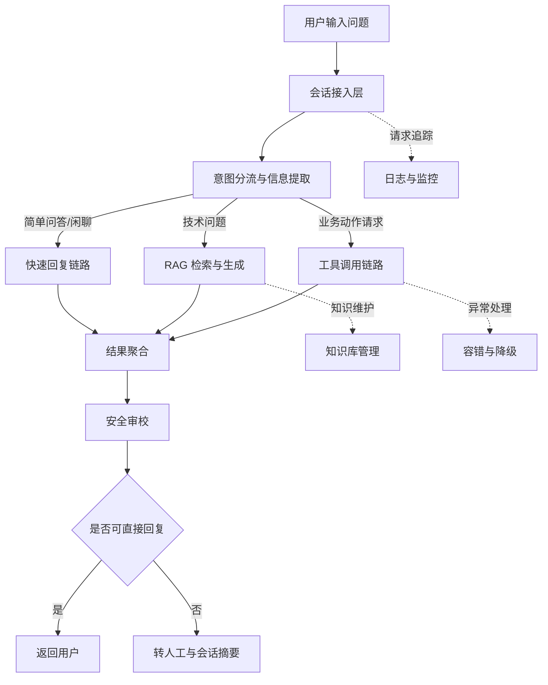

# 智路由 AI 客服系统：项目目标与执行排期

## 一、项目整体功能与目标
本项目定位为一个直接面向终端用户的 AI 客服系统。用户在会话窗口提问后，系统会先判断问题类型，再按场景分流到不同处理链路：简单问答和闲聊走快速回复路径，技术问题走知识检索增强路径，动作型问题走工具调用路径，最终统一经过安全审校后返回结果。

项目目标不是“做一个能聊天的机器人”，而是“做一个可上线、可追踪、可降级、可转人工的客服系统”。整体要同时达成四个业务目的：
1. **响应更快**：高频简单问题快速处理，降低首响应时间。
2. **答案更准**：知识型问题基于可追溯依据回答，减少编造内容。
3. **服务更稳**：外部依赖异常时有兜底与降级，不因单点失败中断服务。
4. **运营可控**：高风险内容拦截、低置信场景转人工、全过程可监控。

---

## 二、项目架构图

---

## 三、执行排期（6 期）

### 第 1 期：搭建可用最小闭环（MVP 起点）
**阶段目标（对整体项目的贡献）**
- 先打通“用户提问 -> 系统返回”的最短路径，确保项目从一开始就可演示、可验证。
- 建立统一输入输出规范，为后续功能扩展提供稳定骨架。

**本期要实现的功能**
- 提供统一会话入口，接收用户问题并返回标准响应结构。
- 建立基础会话上下文管理，支持最小多轮对话。
- 提供健康检查与基础调试接口，便于联调。

**技术选型**
- FastAPI
- Pydantic

**为什么这样选**
- 这套组合可以快速形成标准化接口，减少前后端联调成本。
- 数据结构先统一，后续新增链路时不会反复改协议。

---

### 第 2 期：接入意图分流，完成“先判断再处理”
**阶段目标（对整体项目的贡献）**
- 把系统从“单一路径处理”升级为“按问题类型分工处理”。
- 为后续成本优化和准确率优化建立关键分流入口。

**本期要实现的功能**
- 识别用户意图（技术问题、订单问题、闲聊、投诉等）。
- 提取后续处理所需关键信息（如订单号）。
- 返回结构化路由结果，供下游模块直接消费。

**技术选型**
- 轻量级模型
- Prompt Engineering
- JSON 结构化约束

**为什么这样选**
- 分流任务对复杂推理要求较低，轻量模型足以满足且成本更低。
- 结构化输出能显著降低链路耦合和路由误差放大。

---

### 第 3 期：完成知识问答链路（RAG）
**阶段目标（对整体项目的贡献）**
- 让系统具备“有依据回答技术问题”的能力，提升可用性与可信度。
- 建立知识可追溯机制，为准确率和合规提供基础保障。

**本期要实现的功能**
- 支持知识文件上传、解析、切分、索引。
- 技术问题命中时执行检索增强回答。
- 在回复中附带引用来源片段。

**技术选型**
- LlamaIndex
- ChromaDB
- 检索增强生成（RAG）

**为什么这样选**
- 该组合适合快速搭建本地可控的知识问答链路。
- 检索先行、生成在后的方式更符合客服场景对准确性的要求。

---

### 第 4 期：完成工具调用与 Agent 化编排
**阶段目标（对整体项目的贡献）**
- 让系统从“只会回答”升级为“能执行业务动作”，覆盖更高价值场景。
- 打通结构化工具结果与自然语言回复的融合能力。

**本期要实现的功能**
- 实现订单状态查询等工具接口。
- 在识别到动作型意图时自动调用对应工具。
- 工具失败时提供兜底回复，并保留转人工入口。

**技术选型**
- Agent 工具调用框架
- 结构化工具协议
- Mock/沙盒工具服务

**为什么这样选**
- Agent 化编排更适合多工具扩展，后续可以平滑增加新业务动作。
- 结构化协议便于做参数校验和失败恢复，降低线上风险。

---

### 第 5 期：安全审校、转人工、容错降级
**阶段目标（对整体项目的贡献）**
- 将系统从“可演示”提升为“可上线试运行”。
- 在高风险、高不确定性场景下保证用户体验和业务安全。

**本期要实现的功能**
- 增加输出安全审校与不合规内容拦截。
- 建立转人工机制（触发条件、会话摘要、接管提示）。
- 增加外部调用超时、异常捕获、统一降级文案。

**技术选型**
- 规则审校 + 模型审校组合
- 超时控制与重试策略
- 统一异常处理机制

**为什么这样选**
- 规则审校可控、可解释，模型审校可补充语义覆盖，两者组合更稳。
- 客服系统核心是连续服务能力，超时与降级策略是上线必需品。

---

### 第 6 期：用户端体验与运营监控闭环
**阶段目标（对整体项目的贡献）**
- 形成“用户可用 + 运营可看 + 研发可排障”的完整闭环。
- 为后续迭代提供数据依据，而不是凭感觉优化。

**本期要实现的功能**
- 完成用户会话页面与基础交互体验。
- 提供运营调试视图（意图、链路、耗时、命中来源、转人工率）。
- 建立全链路日志与关键指标看板。

**技术选型**
- Streamlit（演示与管理界面）
- Python logging + trace_id
- 基础指标统计与可视化

**为什么这样选**
- 先用轻量界面快速验证业务流程，缩短反馈周期。
- 有 trace_id 才能定位真实线上问题，指标化才能做有效迭代。

---

## 四、里程碑验收标准（建议）
1. **功能验收**：三条主链路（闲聊、RAG、工具调用）都能稳定跑通。
2. **安全验收**：高风险内容可拦截，低置信问题可转人工。
3. **稳定性验收**：外部依赖失败不导致接口崩溃，存在明确降级反馈。
4. **可观测性验收**：单次请求可通过 trace_id 回放关键处理步骤。
5. **演示验收**：用户端能完成端到端会话，运营端能查看关键调试信息。
