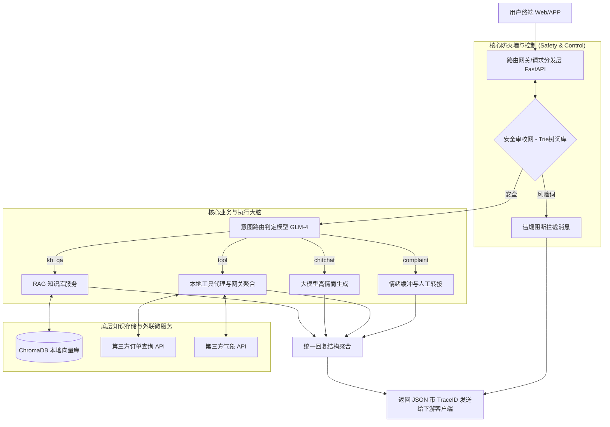

# 智路由 AI 客服系统 (V1.0 最终版)

本项目是一个直接面向终端用户的企业级 AI 客服系统。采用“意图分发 + RAG + API 工具编排”的混合架构，具备工业级安全审校与异常容错降级能力。

## ✨ 核心特性

1. **精准意图路由**：利用大模型将用户意图划分为 `kb_qa`（知识问答）、`chitchat`（闲聊）、`tool`（动作执行）和 `complaint`（投诉与转人工），彻底摆脱死板正则。
2. **本地知识增强 (RAG)**：融合 `LlamaIndex` 与 `ChromaDB`，支持导入私有企业文档，实现大模型“有依据地说话”。
3. **Agent 工具编排**：动态识别工具调用诉求，自动连接并执行后端微服务动作（如查询实时天气、物流订单等）。
4. **工业级安全审校**：基于 `AC自动机 / Trie 树` 的极速文本清洗与 O(N) 复杂度的敏感词拦截。
5. **开箱即用可视化**：后端完全驱动 FastAPI 高性能接口，前端无缝集成 `Streamlit` 提供沉浸式聊天与调试面板。
6. **优雅级容错防御**：全局 TraceID 链路追踪与多层异常降级网，确保在任何极端错误（断网、欠费）下前端不崩。

---

## 🛠️ 技术选型栈
* **应用框架**: `FastAPI` + `Streamlit`
* **模型底座**: 智谱大模型 GLM-4 (API) + HuggingFace BGE 向量模型
* **数据检索**: `LlamaIndex` + 本地 `ChromaDB`
* **参数验证**: `Pydantic`

---

## 🚀 极速启动指南

### 1. 环境准备
确保拥有 `Python 3.10+` 和配置好的虚拟环境。

安装依赖：
```bash
pip install -r requirements.txt
```

### 2. 配置环境变量
在项目根目录创建 `.env` 文件（请自行替换真实 Key）：
```env
ZHIPU_API_KEY=your_zhipu_api_key_here
```

### 3. 一键启动后端
```bash
uvicorn app.main:app --reload
```
后端启动后，可在 `http://127.0.0.1:8000/docs` 查看 Swagger 互动接口文档。

### 4. 启动可视化 Web 界面
新开一个终端：
```bash
streamlit run frontend/streamlit_app.py
```
浏览器将自动弹出包含运行调试面板的实时交互窗口。

---

## 🧪 单元测试
项目遵循严格的测试驱动标准。执行测试覆盖核心逻辑及边界异常：
```bash
pytest tests/ -v
```

---

## 🏗️ 演进架构图


---
感谢对 **智路由 AI 客服** 的关注！本 MVP 阶段项目目前已完成全线排期指标并归档到 V1.0
