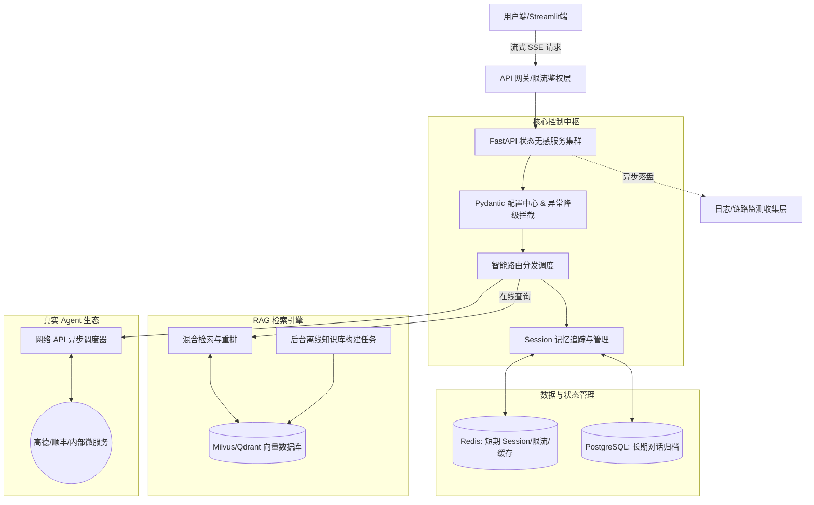

# 智路由 AI 客服系统：V2.0 生产级架构升级排期

## 一、项目整体功能与目标（生产级演进）
在 V1.0 搭建完毕核心逻辑（MVP）的基础上，V2.0 的核心目标是**“消除技术债，实现业务落地与高可用”**。我们将由“能跑通的玩具”向“可抗高并发、可追溯记忆、防内存泄漏、接真实生态”的真正企业级后端架构迈进。

实现以下四个核心业务支撑目标：
1. **记忆与状态可靠**：废弃内存字典，使用成熟的中间件管理用户 Session 与海量聊天记录持久化，引入记忆滑动窗口保护 Token。
2. **基石组件重构**：剥离共用逻辑，消除写死的明文配置与“每次问答都在重新构建 RAG 库”的系统性能痛点。
3. **真实工具生态**：告别伪造数据的本地假 API，使用异步框架真实请求第三方生态，并将响应改造为流式输出提供优良前端体验。
4. **DevOps与监控**：通过容器化保障环境统一，提供防雪崩的请求重试机制与企业级日志监控告警通道。

---

## 二、项目架构图 (V2.0 演进版)

---

## 三、执行排期（6 期）

### 第 1 期：基石重构与工程规范化
**阶段目标（对整体项目的贡献）**
- 消除代码中的“玩具级”硬编码，建立企业级工程规范防线，保护运维磁盘并增强代码的鲁棒性。

**本期要实现的功能**
- 引入环境变量类型校验框架，统一管理各种 API Key 和端口配置。
- 升级 Logging 组件，实现按天截断与 JSON 序列化落盘。
- 在外部 API（大模型）调用层加入指数退避重试（Retry）容错机制。

**技术选型**
- `Pydantic BaseSettings` 
- `Loguru` 工具库
- `Tenacity` 重试组件

**为什么这样选**
- Pydantic Settings 是 FastAPI 生态的标配，能把 `.env` 化为有严格类型校验的 Python 类。
- Loguru 无需繁琐的 Handler 配置，通过一两行代码就能搞定生产级的文件轮转切割。
- 真实的第三方接口极易超时或报 429 限流，Tenacity 提供了非常优雅的装饰器用于错误重试，防止由于网络抖动引发的 500 异常。

---

### 第 2 期：记忆系统的彻底重构（持久化与长短期记忆）
**阶段目标（对整体项目的贡献）**
- 彻底解决单机内存字典存放记忆带来的内存泄漏与重启丢数据问题，引入滑动策略防止 Token 爆表。

**本期要实现的功能**
- 抛弃全局字典，对话上下文由 Redis 接管极速读写，历史长期记录落入关系型数据库做持久化审计。
- 引入“记忆滑动窗口”，确保发给大模型的消息永远不超过最近 10 轮。
- 对超长会话加入异步浓缩能力，小模型总结摘要替代海量前文。

**技术选型**
- `Redis` (热数据) + `PostgreSQL` / `MySQL` (冷数据)
- `SQLAlchemy` (ORM) 

**为什么这样选**
- 对于大并发的在线对话，频繁读写 PostgreSQL 会产生极高延迟；Redis 的极速存取是用户畅聊的保障。
- SQLAlchemy 是 Python 事实上的工业级操作 DB 标准，方便以后应对平滑的数据库表结构迁移。

---

### 第 3 期：RAG 检索引擎“冷热分离”与高阶检索升级
**阶段目标（对整体项目的贡献）**
- 解决每次问答都在重新读取本地文件构建特征向量的“性能灾难”，极大提升海量文档场景的查准率。

**本期要实现的功能**
- 将知识库构建流程完全独立到离线脚本/后台上传接口，问答主流程只做向量检索（即读写分离）。
- 从单纯的 Chroma 向量检索升级为独立向量数据库。
- 增加重排（Rerank）机制，过滤低质量相似度返回片段。

**技术选型**
- 独立服务版向量数据 `Milvus` 或 `Qdrant`
- 本地 `BGE-Reranker` 排序模型

**为什么这样选**
- 系统架构拆分“离线 Build 任务”和“在线 Query 请求”，是高性能服务不可逾越的鸿沟。
- ChromaDB 本地版在低数据量时好用，但大体量后会极度占据 FastAPI 内存，走专属数据库引擎能支撑分布式并发扩容。
- Reranker 能够在第一遍粗筛后做一轮“精读精筛”，实实在在解决大模型知识库“答非所问/抓错文档”的核心痛点。

---

### 第 4 期：Agent 工具生态对接与流式输出（SSE）改造
**阶段目标（对整体项目的贡献）**
- 告别写死的伪造数据，系统能真正调度真实世界的外部资源，极大提高前端用户交互的“呼吸愉悦感”。

**本期要实现的功能**
- 把工具调用代码（Tool Calls）对接向真实的外部 OpenAPI，如调用请求天气、物流微服务。
- 引入异步 HTTP 客户端进行外网请求加速。
- 主体对话接口从“等五秒才回一整段”改为“逐字跳动式返回”。

**技术选型**
- `AIOHTTP` 或 `HTTPX` (异步请求)
- `Server-Sent Events (SSE)` 流式协议

**为什么这样选**
- 纯 Python 自带的 `requests` 会阻塞 FastAPI 的事件循环，高并发时会导致其他用户等待，必须升级为 `AIOHTTP` 等非阻塞异步 IO 发起网络请求。
- 对于长文本大模型，SSE（文本流式响应）是当前 AI 赛道绝对的工业标准，能极大削弱用户“卡顿”的心理预期。

---

### 第 5 期：鉴权防刷与多租户隔离
**阶段目标（对整体项目的贡献）**
- 将系统从开源测试玩具转变为“持证上岗”的商业底座，防范黑产薅羊毛和盗刷 API Token。

**本期要实现的功能**
- 引入用户登录或 API Key 分配认证，给每个连接打上标签。
- 限制特定用户的调用速率（如 10次/分钟）。

**技术选型**
- `FastAPI-Security` (OAuth2 / JWT 规范)
- `Redis Token Bucket`（令牌桶限流算法）

**为什么这样选**
- JWT（JSON Web Token）天生无状态，配合 FastAPI 集成的安全模块实现丝滑的数据解签核验。
- 在 Redis 中实现一套令牌桶是公认最高效、代价最低的并发访问频率墙，能秒级拦截恶意高频发包。

---

### 第 6 期：容器打包与 DevOps 闭环
**阶段目标（对整体项目的贡献）**
- 终结“在我的电脑上能跑，但在你那报错”的经典梦魇，形成随时向任何机房进行交付标准产物的能力。

**本期要实现的功能**
- 编写多阶段构建的 `Dockerfile`，极大降低 Python 镜像体积。
- 编写 `docker-compose.yml`，使用一行命令把 FastAPI/Redis/DB/向量数据库拉起互通。

**技术选型**
- `Docker` & `Docker-Compose`

**为什么这样选**
- Docker 实现了系统级的环境大一统封装。只要构建好镜像，不仅部署不用烦心那些千奇百怪的包版本冲突，更是日后对接 Kubernetes 进行集群拉伸的基础入场券。
