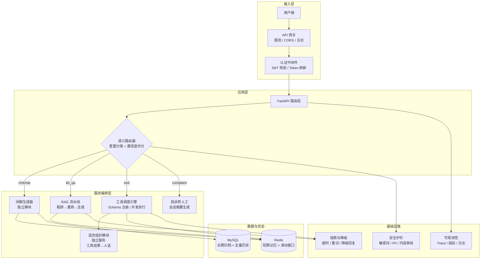

# 智路由 AI 客服系统：V3.0 企业级深度优化方案

> **执行原则**：修补之前留下的"坑"永远比引入新模块重要。
> 哪怕原有模块功能简陋，第一步也不是给这个模块补功能，先把并发性和稳定性的坑填了。
> 顺序是：**填坑 → 改旧 → 建新**。

---

## 一、V3.0 总体目标

V2.0 完成了从"玩具"到"可运行系统"的跨越——记忆持久化、RAG 冷热分离、工具生态、鉴权限流。但对照生产级 AI 客服系统，当前代码里仍然埋着不少"坑"：

- 并发模型有阻塞隐患，多用户同时请求可能互相拖死
- 安全上有硬编码密钥和未鉴权接口
- 异常响应丢了 session_id，出了事追查不了
- 测试和代码脱节，改了东西不知道有没有 break

V3.0 不做大功能加法。V3.0 只做一件事：**让系统真正可运维**。

三个执行阶段：

**第一阶段（填坑）**：把当前代码里影响稳定性和安全性的缺陷全部修复。不引入新模块，不改架构，只修 bug 和补防撞栏。

**第二阶段（改旧）**：对功能过于简陋的现有模块做工程化改造——保持接口不变，把内部实现从"能跑"提升到"能扛"。

**第三阶段（建新）**：前两个阶段全部完成后，引入真正需要的新模块和能力。

---

## 二、项目架构图（V3.0 目标态）

---

## 三、排期：三阶段执行

---

### 第一阶段：填坑（修复现有缺陷）

**原则**：不改接口、不重构、不加新功能。只修当前代码里确定有问题的 bug 和安全隐患。

---

#### 任务 1.1：并发模型修复（P0）

**坑的特征**：当前代码中，同步调用混杂在异步事件循环里，多用户并发时会串行阻塞。

**涉及文件**：
- [tool_service.py](file:///e:/AI_Agent/app/services/tool_service.py#L8-L12)——使用同步 `OpenAI()` 而非 `AsyncOpenAI`
- [rag_service.py](file:///e:/AI_Agent/app/services/rag_service.py#L137)——`query_knowledge` 是同步函数，在异步 stream_generator 中被直接调用
- [chat.py](file:///e:/AI_Agent/app/api/v1/endpoints/chat.py#L54-L133)——所有外部调用均无 `asyncio.wait_for` 超时熔断

**具体修复项**：

1. `tool_service.py` 将 `OpenAI` 替换为 `AsyncOpenAI`，所有 `.create()` 调用加 `await`
2. `rag_service.py` 将 `query_knowledge` 改为 `async def`，内部调用改为异步或 `run_in_executor`
3. `chat.py` 的 `stream_generator` 中，大模型调用加 `asyncio.wait_for(..., timeout=15)`，外部 API 调用加 `asyncio.wait_for(..., timeout=5)`
4. 确认 Reranker 模型已预加载为全局单例，不在查询路径中重复加载

**验收标准**：3 个并发用户同时发消息，无阻塞、无超时、均正常返回流式响应。

---

#### 任务 1.2：安全漏洞修复（P0）

**坑的特征**：多处硬编码密钥、鉴权缺失，上线即高危。

**涉及文件**：
- [auth_service.py](file:///e:/AI_Agent/app/services/auth_service.py#L12)——`JWT_SECRET_KEY = ZHIPU_API_KEY[::-1]`
- [tool_service.py](file:///e:/AI_Agent/app/services/tool_service.py#L15)——`GAODE_WEATHER_KEY` 硬编码
- [kb.py](file:///e:/AI_Agent/app/api/v1/endpoints/kb.py#L8)——`POST /api/v1/kb/build` 无任何认证
- [main.py](file:///e:/AI_Agent/app/main.py)——无 CORS 中间件配置

**具体修复项**：

1. `config.py` 新增 `JWT_SECRET_KEY: str` 配置项（独立随机字符串，从 `.env` 读取）
2. `config.py` 新增 `GAODE_WEATHER_KEY: str` 配置项，[tool_service.py](file:///e:/AI_Agent/app/services/tool_service.py#L15) 改为从 `settings` 读取
3. `config.py` 新增 `ADMIN_TOKEN: str` 配置项，[kb.py](file:///e:/AI_Agent/app/api/v1/endpoints/kb.py) 增加 `X-Admin-Token` Header 校验
4. [main.py](file:///e:/AI_Agent/app/main.py) 增加 `CORSMiddleware`，生产环境明确允许的 Origins
5. `auth.py` 登录/注册端点增加 IP 级别的限流保护（5 次/分钟）

**验收标准**：所有硬编码密钥从代码中移除；未带 Admin Token 的 `/api/v1/kb/build` 请求返回 403；`curl -X POST` 登录端点连续 6 次后触发限流返回 429。

---

#### 任务 1.3：异常处理修复（P0）

**坑的特征**：出了错查不到源头，所有异常响应的 `session_id` 写死为 `"unknown"`，没有错误码，前端无法做差异化处理。

**涉及文件**：
- [main.py](file:///e:/AI_Agent/app/main.py#L44-L93)——3 个全局异常处理器

**具体修复项**：

1. 新建 `app/core/exceptions.py`，定义业务异常基类和具体异常类（选做，小成本方案也可以直接在异常处理器中处理）
2. 全局异常处理器从请求上下文中提取 `session_id`（而非写死 `"unknown"`）
3. 异常响应体中增加 `trace_id: str` 字段，与请求的 trace_id 贯通
4. 异常响应体中增加 `error_code: str` 字段，按场景区分（如 `RATE_LIMIT`、`SERVICE_UNAVAILABLE`、`SAFETY_REJECT`）

**验收标准**：向 `/api/v1/chat/` 发送非法参数，返回的 JSON 中包含正确的 `session_id` 和 `trace_id`，且 `error_code` 能区分错误类型。

---

#### 任务 1.4：测试修复（P1）

**坑的特征**：测试和代码脱节，改了东西没有安全网。

**涉及文件**：
- [test_tool.py](file:///e:/AI_Agent/tests/test_tool.py#L1-L56)——`test_get_weather` 测的是同步函数但代码已改为异步
- [test_rag.py](file:///e:/AI_Agent/tests/test_rag.py#L7)——mock 路径 `build_or_load_index` 与当前代码对不上
- [conftest.py](file:///e:/AI_Agent/conftest.py)——空文件，没有全局配置
- 服务层（auth、session、memory、ratelimit）无任何测试覆盖

**具体修复项**：

1. 修复 `test_tool.py`：将同步测试改为 `pytest.mark.asyncio` 异步测试，mock `AsyncOpenAI` 而非 `OpenAI`
2. 修复 `test_rag.py`：将 mock 路径更新为当前代码的实际函数名
3. `conftest.py` 配置全局 `pytest-asyncio` 和测试用 Redis/DB 连接（可选）
4. 新建 `tests/test_auth_service.py`（覆盖注册、登录、Token 加解密）
5. 新建 `tests/test_session_service.py`（覆盖会话 CRUD）
6. 新建 `tests/test_memory.py`（覆盖消息读写和滑动窗口）
7. 新建 `tests/test_ratelimit.py`（覆盖限流计数和过期）
8. 配置 `pytest-cov`，设定覆盖率目标（服务的核心函数覆盖 >= 80%）

**验收标准**：`pytest tests/ -v` 全部通过；新测试覆盖所有 service 层函数；`pytest --cov` 可输出覆盖率报告。

---

#### 任务 1.5：基础设施坑修复（P2）

**坑的特征**：中间件连接参数硬编码，依赖混乱。

**涉及文件**：
- [memory.py](file:///e:/AI_Agent/app/core/memory.py#L7)——`redis.Redis(host='localhost', port=6379, ...)`
- [requirements.txt](file:///e:/AI_Agent/requirements.txt)——156 个包，包含 `kubernetes`、`chromadb` 等未使用依赖

**具体修复项**：

1. `config.py` 新增 `REDIS_HOST`、`REDIS_PORT`、`REDIS_DB` 等配置项，`memory.py` 从 `settings` 读取
2. 清理 `requirements.txt`：移除未使用的包（如 `kubernetes`、`chromadb` 等）
3. 将 `requirements.txt` 拆分为 `requirements-prod.txt`（运行时依赖）和 `requirements-dev.txt`（测试、开发工具）

**验收标准**：中间件连接参数全部走 `config.py` 配置；生产依赖列表缩减至 50 个以内。

---

### 第二阶段：改旧（改造功能简陋的现有模块）

**原则**：接口保持不变，对内部实现做工程化升级。不改对外契约。

---

#### 任务 2.1：语义路由加固（P1）

**现状**：仅靠 System Prompt + `temperature=0.0` 约束大模型输出 JSON——边界模糊场景无兜底，无置信度评估。

**改造内容**：

1. `RouterResult` 增加 `confidence: float` 字段
2. 引入正则规则表前置过滤（高频意图如"汇率"→ tool、"报销"→ kb_qa 等），规则命中时 confidence 设为 1.0 直接跳过 LLM
3. LLM 分析结果附带 confidence 分数（从 prompt 中要求输出 `confidence` 字段）
4. confidence < 阈值（如 0.6）时进入"澄清反问"流程而非强行猜测

**涉及文件**：
- [schemas.py](file:///e:/AI_Agent/app/models/schemas.py#L78-L87)——`RouterResult` 增加字段
- [router_service.py](file:///e:/AI_Agent/app/services/router_service.py#L1-L91)——增加正则前置过滤 + confidence
- [chat.py](file:///e:/AI_Agent/app/api/v1/endpoints/chat.py)——增加低置信度返回分支

---

#### 任务 2.2：安全模块加固（P1）

**现状**：敏感词库仅 4 个词，无 PII 检测，无输出端安全检测。

**改造内容**：

1. 扩充 `SENSITIVE_WORDS` 词库至 30+ 条，覆盖常见违规类别
2. 新增 PII 正则检测（手机号 `1[3-9]\d{9}`、身份证 `\d{17}[\dXx]`、银行卡号）
3. 新增 `check_output_safety(text: str) -> bool` 输出端检测函数
4. 敏感词从硬编码改为从配置文件或 Redis 热加载

**涉及文件**：
- [safety_service.py](file:///e:/AI_Agent/app/services/safety_service.py)——扩充词库、新增 PII 检测、新增输出端检测
- [chat.py](file:///e:/AI_Agent/app/api/v1/endpoints/chat.py)——在返回前调用输出端安全检测

---

#### 任务 2.3：工具模块改旧（P1）

**现状**：3 个工具硬编码映射，无缓存、无健康检查、无注册表。

**改造内容**：

1. 新建 `app/services/tool_registry.py`，定义 `Tool` 数据类（name, description, schema, handler, timeout, cache_ttl）
2. 将 `available_functions` 和 `tools_schema` 合并到注册表中
3. 为 `get_weather`、`get_exchange_rate` 增加 Redis 缓存（幂等查询缓存 5 分钟）
4. 新增工具健康检查函数 `check_tool_health(name: str) -> bool`，调用不可用时自动降级

**涉及文件**：
- 新建 `app/services/tool_registry.py`
- [tool_service.py](file:///e:/AI_Agent/app/services/tool_service.py)——改为基于注册表的调度方式，接入缓存和健康检查

---

#### 任务 2.4：记忆系统改旧（P2）

**现状**：MySQL 只写不查，无全量历史回溯能力，无记忆摘要。

**改造内容**：

1. 新增 `get_session_history(user_id, session_id, start_time, end_time)` 接口，从 MySQL 按时间范围查询全量历史
2. 新增 `summarize_session(session_id)` 函数，用大模型对整段对话做摘要
3. 记忆的"写入"和"查询"拆分为独立接口

**涉及文件**：
- [history_service.py](file:///e:/AI_Agent/app/services/history_service.py)——新增历史查询方法
- [memory.py](file:///e:/AI_Agent/app/core/memory.py)——保持滑动窗口逻辑不变，新增摘要触发机制
- [sessions.py](file:///e:/AI_Agent/app/api/v1/endpoints/sessions.py)——新增历史查询端点（可选）

---

#### 任务 2.5：架构分层改旧——巨石拆解（P2）

**现状**：[chat.py](file:///e:/AI_Agent/app/api/v1/endpoints/chat.py#L48-L133) 的 `stream_generator` 是巨石闭包：路由分发 + 流式生成 + 记忆存储 + DB 归档 + 锁释放全揉在一起。

**改造内容**：

1. 将 `stream_generator` 抽离为独立的 `ChatService` 类，放在 `app/services/chat_service.py`
2. 将 `generate_chitchat` 从 [router_service.py](file:///e:/AI_Agent/app/services/router_service.py) 抽出到独立的 `app/services/chitchat_service.py`
3. [memory.py](file:///e:/AI_Agent/app/core/memory.py) 拆分为 `RedisClient`（连接管理）和 `MemoryStore`（消息 CRUD + 滑动窗口策略）
4. 引入简单的依赖注入模式：服务类通过 `__init__` 接收依赖，而非直接 import 全局变量

**涉及文件**：
- 新建 `app/services/chat_service.py`
- 新建 `app/services/chitchat_service.py`
- [chat.py](file:///e:/AI_Agent/app/api/v1/endpoints/chat.py)——精简为只做参数提取和调用 ChatService
- [memory.py](file:///e:/AI_Agent/app/core/memory.py)——拆分为两个类
- [router_service.py](file:///e:/AI_Agent/app/services/router_service.py)——移除 generate_chitchat

---

### 第三阶段：建新（引入新的模块和能力）

**原则**：前两个阶段全部验收通过后，再启动新模块。不并行，不抢跑。

---

#### 任务 3.1：语言组织模块独立（P1）

**动机**："工具结果→人话"的逻辑当前内嵌在 `tool_service.py` 的第二回合调用中，与工具执行耦合。kb_qa 分支也有同样的"检索结果→人话"需求但实现路径不同。

**建设内容**：

1. 新建 `app/services/polish_service.py`
2. `async def polish_response(raw_data: str, context: dict) -> str`——输入原始数据 + 上下文，输出自然语言回复
3. chat.py 中 kb_qa 分支和 tool 分支统一调用 `polish_service`

---

#### 任务 3.2：可观测性建设（P2）

**动机**：当前只有 Loguru 日志，没有指标、没有追踪、健康检查只返回静态 `"ok"`。

**建设内容**：

1. 新建 `app/core/telemetry.py`——管理 trace_id 生成和透传上下文
2. trace_id 通过 SSE `event: trace` 返回给前端
3. `GET /health` 升级为深度检查：尝试 ping Redis、MySQL、Qdrant
4. 接入 Prometheus 指标：`chat_messages_total`、`intent_distribution`、`tool_call_duration_seconds`

---

#### 任务 3.3：API 设计规范化（P3）

**动机**：正常路径返回 SSE 流，错误路径返回 JSON——前端需兼容两种解析模式；删除会话返回 200 而非 204。

**建设内容**：

1. 错误统一走 `JSONResponse` 但附带 `session_id` 和 `trace_id`
2. 删除操作改为 204 No Content
3. 完善 OpenAPI tags 和 description

---

#### 任务 3.4：DevOps 与基础设施（P3）

**动机**：裸机运行，无 Docker 化，无 CI。

**建设内容**：

1. FastAPI + Streamlit 分别编写 Dockerfile
2. `docker-compose.yml` 编排完整服务栈（FastAPI + Redis + MySQL + Qdrant + Streamlit）
3. 配置 GitHub Actions：每次 push 自动运行 `pytest`

---

## 四、排期总览

| 阶段 | 任务 | 优先级 | 预估工作量 | 依赖 | 核心产出 |
|------|------|--------|-----------|------|---------|
| **填坑** | 1.1 并发模型修复 | P0 | 1d | 无 | tool_service 改为 AsyncOpenAI / RAG 异步化 / asyncio.wait_for |
| **填坑** | 1.2 安全漏洞修复 | P0 | 1d | 无 | 密钥全部走 .env / kb/build 加鉴权 / CORS / IP 限流 |
| **填坑** | 1.3 异常处理修复 | P0 | 0.5d | 无 | session_id 正确传递 / error_code / trace_id |
| **填坑** | 1.4 测试修复 | P1 | 2d | 1.1（并发修复后测试才能真修） | 测试全部通过 / service 层全覆盖 |
| **填坑** | 1.5 基础设施坑修复 | P2 | 0.5d | 无 | Redis 配置可配 / requirements 清理 |
| **改旧** | 2.1 语义路由加固 | P1 | 1.5d | 1.4（需测试保护） | confidence 评分 / 正则前置过滤 / 低置信兜底 |
| **改旧** | 2.2 安全模块加固 | P1 | 1d | 无 | 30+ 敏感词 / PII 检测 / 输出端检测 |
| **改旧** | 2.3 工具模块改旧 | P1 | 1.5d | 无 | tool_registry / 缓存 / 健康检查 |
| **改旧** | 2.4 记忆系统改旧 | P2 | 1.5d | 无 | MySQL 历史查询 / 会话摘要 |
| **改旧** | 2.5 架构分层改旧 | P2 | 2d | 1.1（并发修完再拆，否则边拆边漏） | ChatService / chitchat_service / Memory 拆解 |
| **建新** | 3.1 语言组织模块 | P1 | 1d | 2.5（架构分层完成后） | polish_service |
| **建新** | 3.2 可观测性建设 | P2 | 2d | 2.5（架构分层完成） | telemetry.py / 深度健康检查 / Prometheus |
| **建新** | 3.3 API 设计规范化 | P3 | 1d | 无 | 统一响应格式 / 204 删除 / OpenAPI |
| **建新** | 3.4 DevOps | P3 | 2d | 1.4（测试通过后） | Dockerfile / docker-compose / CI |

---

## 五、执行纪律

1. **不允许跳阶段**：填坑阶段未全部完成前，不得进入改旧阶段。改旧阶段未全部完成前，不得进入建新阶段。
2. **每个任务完成后必须跑通测试**：改动代码后 `pytest tests/ -v` 零失败才算完成。
3. **不改对外接口**：填坑和改旧阶段，不修改 API 路由、请求/响应结构、SSE 事件格式。
4. **一个任务一个 commit**：每个排期任务对应一个独立的 git commit，方便回滚追溯。

---

## 六、验收标准

1. **并发验收**：3 个并发用户同时发消息，系统无阻塞、无超时、均正常返回
2. **安全验收**：暴力登录 10 次后触发限流；敏感词/PII 输入被拦截；Token 过期返回 401；无硬编码密钥
3. **测试验收**：`pytest tests/ -v` 全部通过；service 层覆盖率 >= 80%
4. **可观测验收**：健康检查验证所有中间件存活；trace_id 串联单次请求全流程
5. **架构验收**：chat.py 中无巨石逻辑，所有核心函数可独立测试
