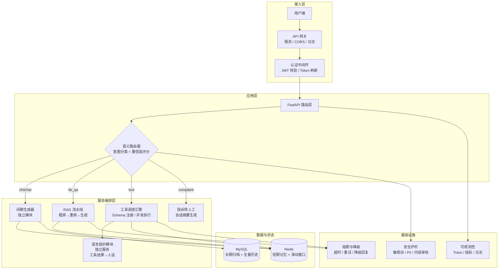

# 智路由 AI 客服系统：V3.0 企业级深度优化方案

> **对标参考**：本方案部分设计理念参考 Claude Code 架构（Harness Engineering 方法论），强调**模型能力只占 60%，40% 靠精心设计的工程系统**——工具调用、权限控制、记忆管理、安全护栏、可观测性缺一不可。

---

## 一、V3.0 总体目标

V2.0 完成了从"玩具"到"可运行系统"的跨越（基石重构、记忆持久化、RAG 冷热分离、工具生态、鉴权限流），但对照生产级 AI 客服系统仍有显著差距。

V3.0 的核心目标是：**从"能跑"到"能扛、能查、能信、能改"**。

四个关键方向：
1. **能扛**：并发模型不阻塞，超时有熔断，安全有纵深
2. **能查**：全链路可观测，任何异常可追溯，健康检查真实有效
3. **能信**：测试覆盖核心链路，路由准确可量化，回答有据可查
4. **能改**：架构分层清晰，模块可独立测试、独立部署、独立演进

---

## 二、项目架构图（V3.0 目标态）



---

## 三、改进方案（15 个维度）

### Phase 1：核心质量加固（6 项）

#### 1.1 语义路由准确性提升

**现状问题**：
- 仅靠 System Prompt + `temperature=0.0` 约束大模型输出 JSON，缺乏路由置信度评估
- "美元相对人民币汇率"被误判为 `kb_qa`，边界模糊场景无兜底
- 无路由效果的可量化指标，优化只能靠"感觉"

**改进方案**：

```
路由判定流水线（由浅入深）：
1. 关键词硬规则匹配（正则 / Trie）→ 极高置信度直接返回
2. LLM 语义分析 + 置信度评分 → 附带 confidence 分数
3. 置信度 < 阈值（如 0.6）→ 进入"澄清反问"流程而非强行猜测
```

**Claude Code 参考**：Claude Code 在 Auto Mode 中引入了**竞赛模式**——安全分类器与用户交互竞速，200ms 内给出判断。路由层也可以借鉴：先用轻量级规则快速命中高频意图，LLM 只处理模糊边界。

**具体实施**：
- `RouterResult` 增加 `confidence: float` 字段
- 引入正则规则表前置过滤（如"汇率"→ tool、"报销"→ kb_qa）
- 建立路由准确率测试集（至少 50 条标注样本），每次修改后跑回归

---

#### 1.2 RAG 模块优化

**现状问题**：
- `query_knowledge` 是同步函数，在异步生成器中直接调用阻塞事件循环
- Reranker 每次查询加载模型，无缓存机制
- 知识库构建接口无认证，任何人都能触发重建
- 无检索结果时的兜底策略缺失（空响应直接报错）

**改进方案**：
- 将 `query_knowledge` 改为异步函数（`async def`），使用 `run_in_executor` 或在初始化时预加载模型
- Reranker 模型预加载为全局单例（当前已做，需确认不重复加载）
- `POST /api/v1/kb/build` 增加 Admin Token 鉴权
- 检索结果为空时返回友好提示而非报错

**具体实施**：
- [rag_service.py](file:///e:/AI_Agent/app/services/rag_service.py#L137) `query_knowledge` 改为 `async def query_knowledge`
- [rag_service.py](file:///e:/AI_Agent/app/services/rag_service.py#L17) `RERANKER_MODEL` 全局单例增加 `lazy_load` 机制
- [kb.py](file:///e:/AI_Agent/app/api/v1/endpoints/kb.py#L8) 增加 `X-Admin-Token` Header 校验

---

#### 1.3 语言组织模块独立

**现状问题**：
- 当前"工具调用结果 → 人话包装"的逻辑内嵌在 [tool_service.py](file:///e:/AI_Agent/app/services/tool_service.py#L200-L211) 的第二回合调用中
- 与"工具执行"逻辑耦合，无法独立测试或复用
- chat.py 的 kb_qa 分支同样有"检索结果→人话"的需求，但实现路径不同

**改进方案**：

```
独立的语言组织层（Language Polish Service）：
- 输入：原始数据（工具结果 / RAG 片段 / 系统日志）+ 上下文（用户意图、历史对话）
- 输出：自然语言回复
- 可独立测试、可替换模型、可单独限流
```

**Claude Code 参考**：Claude Code 的 System Prompt 采用**分段缓存策略**——静态部分全局共享，动态部分按会话加载。语言组织模块的 System Prompt 也应当分段：固定格式指令 + 动态上下文。

**具体实施**：
- 新建 `app/services/polish_service.py`
- 将 [tool_service.py](file:///e:/AI_Agent/app/services/tool_service.py#L200-L211) 的第二回合调用抽离为 `async def polish_response(raw_data: str, context: dict) -> str`
- chat.py 中 kb_qa 分支和 tool 分支统一调用 polish_service

---

#### 1.4 敏感词屏蔽优化

**现状问题**：
- 词库仅 4 个敏感词（"作弊"、"不合规"、"违禁词1"、"违规操作"）
- 无 PII（个人身份信息）检测：手机号、身份证号、银行卡号无拦截
- 无输出端安全检测（AI 可能生成不当内容）
- 语义级别的违规（如隐晦的辱骂）无法覆盖

**改进方案**：

```
安全护栏四层架构（参考 Claude Code 安全流水线）：
1. 规则层：Trie 树敏感词（输入）+ 正则 PII 检测（输入）
2. 格式层：输出内容格式校验（防止 prompt 注入泄露 system prompt）
3. 语义层：轻量模型对输入/输出做分类（可选，高阶）
4. 熔断层：检测到违规后记录日志、通知管理员
```

**Claude Code 参考**：Claude Code 的安全架构是**四层决策流水线**——权限规则 → 模式模拟 → 白名单 → AI 分类器 + 熔断机制。每一层都可以独立阻止操作。

**具体实施**：
- 扩充 `SENSITIVE_WORDS` 词库至 30+ 条，覆盖常见违规类别
- [safety_service.py](file:///e:/AI_Agent/app/services/safety_service.py#L28-L31) 增加 `check_output_safety(text: str) -> bool` 输出检测函数
- 新增 PII 正则检测（手机号 `1[3-9]\d{9}`、身份证 `\d{17}[\dXx]`）
- 敏感词从硬编码改为配置文件或 Redis 热加载

---

#### 1.5 工具优化

**现状问题**：
- 仅实现 3 个工具（天气、订单、汇率），且天气 Key 已失效
- 无工具自动选择机制——硬编码映射表 `available_functions`，每次调用都遍历
- 工具执行结果无缓存，相同查询重复请求外部 API
- 无工具健康检查，调用不可用的工具浪费时间和 Token

**改进方案**：

```
工具调度引擎（借鉴 Claude Code 工具注册体系）：
1. 声明式注册：每个工具一个独立配置项（名称、描述、参数 Schema、超时、重试策略）
2. 自动路由：LLM 根据工具描述自动选择，而非硬编码 if-else
3. 结果缓存：幂等查询（天气、汇率）缓存 5-30 分钟
4. 健康探针：定期检查工具可用性，不可用时自动降级
```

**Claude Code 参考**：Claude Code 有 40+ 工具，**每个工具有独立的 prompt 文件（prompt.ts）定义行为边界**。工具注册与执行引擎彻底解耦，新增工具只需新建配置文件。

**具体实施**：
- 新建 `app/services/tool_registry.py`，定义 `Tool` 数据类（name, description, schema, handler, timeout, cache_ttl）
- 将 `available_functions` 和 `tools_schema` 合并到注册表中
- 为 get_weather、get_exchange_rate 增加 Redis 缓存（5 分钟过期）
- 新增工具健康检查函数 `check_tool_health(name: str) -> bool`

---

#### 1.6 异常处理优化

**现状问题**：
- 全局异常处理器合并 [main.py](file:///e:/AI_Agent/app/main.py#L44-L93) 中，只粗略分了 3 类（Validation、HTTP、兜底）
- 所有错误响应的 `session_id` 都写死为 `"unknown"`
- 无业务语义的错误码，前端无法根据错误类型做差异化处理
- 大模型调用失败、Redis 宕机、外部 API 超时无分级降级策略

**改进方案**：

```
分级异常处理体系：
1. 可恢复错误（API 超时 / 限流）→ 自动重试 + 返回友好提示
2. 局部不可用（RAG 宕机 / 工具不可用）→ 降级到闲聊或明确告知
3. 系统级崩溃（Redis 断连 / 数据库宕机）→ 全局兜底 + 告警通知
```

**具体实施**：
- 新建 `app/core/exceptions.py`，定义业务异常类（`ServiceUnavailableError`, `ToolExecutionError`, `ModelTimeoutError`）
- 异常响应体中增加 `error_code: str` 和 `trace_id: str` 字段
- 在 `stream_generator` 中为每个分支加入 `asyncio.wait_for` 超时控制
- 恢复时正确传递请求中的 `session_id` 到异常响应

---

### Phase 2：工程体系加固（5 项）

#### 2.1 测试体系重构

**现状问题**：
- 测试与代码脱节（`test_tool.py` 测同步函数但代码已改为异步）
- Mock 过度：核心函数被替换，测试在测"假逻辑"而非真实行为
- 服务层（auth、session、memory、ratelimit）零测试覆盖
- 无集成测试：从未验证过 HTTP → 路由 → 服务 → 存储的全链路

**改进方案**：

```
测试金字塔策略：
1. 单元测试（占比 60%）：独立测试每个 service 函数，外部依赖（Redis/DB）用 mock
2. 集成测试（占比 30%）：启动测试 Redis + 测试 MySQL，验证真实读写
3. E2E 测试（占比 10%）：验证关键用户场景（注册→登录→发消息→收回复）
```

**Claude Code 参考**：Claude Code 的测试体系覆盖了工具调用的每一个边界条件、权限模型的每一个分支。测试不是"点缀"，而是**重构的安全网**。

**具体实施**：
- 修复 `test_tool.py`：`test_get_weather` 改为异步测试（`pytest.mark.asyncio`）
- 新建 `tests/test_auth_service.py`、`tests/test_session_service.py`、`tests/test_memory.py`、`tests/test_ratelimit.py`
- 新建 `tests/test_integration.py`：用测试 Redis 验证完整的存储和读取流程
- 配置 `pytest-asyncio` 和 `pytest-cov`

---

#### 2.2 安全纵深加固

**现状问题**：
- JWT 密钥 = ZHIPU_API_KEY 反转，API Key 泄露则 Token 可伪造
- 高德 Key 硬编码在代码中
- 认证端点无防暴力破解
- 无 CORS 配置
- 知识库构建接口无认证

**改进方案**：

```
安全加固清单：
1. 密钥管理：JWT_SECRET_KEY 改为独立随机字符串，从 .env 读取
2. 敏感信息：所有 API Key 走环境变量，代码中不留任何硬编码密钥
3. 登录防爆：login/register 接口增加 IP 级别限流（5 次/分钟）
4. CORS：配置 CORSMiddleware，生产环境明确允许的 Origins
5. 管理接口：Admin 操作统一走 Bearer Token + 独立权限校验
```

**具体实施**：
- [auth_service.py](file:///e:/AI_Agent/app/services/auth_service.py#L12) 新增 `JWT_SECRET_KEY` 独立配置项
- `GAODE_WEATHER_KEY` 从 [tool_service.py](file:///e:/AI_Agent/app/services/tool_service.py#L15) 移到 [config.py](file:///e:/AI_Agent/app/core/config.py) 
- [main.py](file:///e:/AI_Agent/app/main.py) 增加 `CORSMiddleware`
- [auth.py](file:///e:/AI_Agent/app/api/v1/endpoints/auth.py) 登录注册端点增加 IP 限流

---

#### 2.3 并发模型优化

**现状问题**：
- [tool_service.py](file:///e:/AI_Agent/app/services/tool_service.py) 使用同步 `OpenAI()` 客户端，在异步函数中调用阻塞事件循环
- `query_knowledge` 是同步函数，在 `stream_generator` 中直接调用
- 所有大模型推理和 API 调用都无超时控制
- 多用户并发时，请求串行排队处理

**改进方案**：

```
异步化改造策略：
1. OpenAI 客户端：同步 → 异步（AsyncOpenAI），已在 router_service 实现但 tool_service 遗漏
2. RAG 查询：async def + run_in_executor 避免阻塞事件循环
3. 超时熔断：asyncio.wait_for 包裹所有外部调用（大模型 15s / 外部 API 5s）
4. 并发隔离：耗时操作丢给线程池执行器，主循环处理新请求
```

**具体实施**：
- [tool_service.py](file:///e:/AI_Agent/app/services/tool_service.py#L8-L12) 将 `OpenAI` 改为 `AsyncOpenAI`，`client.chat.completions.create` 改为 `await`
- [rag_service.py](file:///e:/AI_Agent/app/services/rag_service.py#L137) 将 `query_knowledge` 改为 `async def`
- [chat.py](file:///e:/AI_Agent/app/api/v1/endpoints/chat.py) 的 `stream_generator` 中所有外部调用加 `asyncio.wait_for`

---

#### 2.4 可观测性建设

**现状问题**：
- 只有日志（loguru），没有指标（Metrics）和追踪（Tracing）
- `trace_id` 仅记录在日志中，未透传到下游服务，也未返回给前端
- 健康检查只返回静态 `"ok"`，不验证 Redis/MySQL/Qdrant 是否存活
- 无法回答"今天 API 调用量多少"、"P95 延迟多少"、"哪个工具最常用"

**改进方案**：

```
可观测性三支柱：
1. 日志（Logs）：已有 loguru，增加结构化 JSON 日志格式
2. 指标（Metrics）：接入 Prometheus 客户端，记录请求量、延迟、错误率
3. 追踪（Tracing）：trace_id 透传到所有下游调用，返回给前端
```

**Claude Code 参考**：Claude Code 的每个请求都有完整的追踪链路，从用户输入到工具执行到结果返回，每一步都有计时和记录。**没有测量就没有优化**。

**具体实施**：
- 新增 `app/core/telemetry.py`，管理 trace_id 生成和透传上下文
- [chat.py](file:///e:/AI_Agent/app/api/v1/endpoints/chat.py) 中将 `trace_id` 通过 SSE `event: trace` 返回给前端
- `GET /health` 升级为深度检查：尝试 ping Redis、MySQL、Qdrant
- 记录关键指标：`chat_messages_total`、`intent_distribution`、`tool_call_duration_seconds`

---

#### 2.5 架构分层优化

**现状问题**：
- [chat.py](file:///e:/AI_Agent/app/api/v1/endpoints/chat.py#L48-L133) 的 `stream_generator` 是巨石闭包：路由分发 + 流式生成 + 记忆存储 + DB 归档 + 锁释放全在一起
- 路由分析和闲聊生成耦合在 [router_service.py](file:///e:/AI_Agent/app/api/v1/endpoints/../services/router_service.py) 中
- 没有依赖注入，服务层直接 import 全局变量，无法在测试中替换
- [memory.py](file:///e:/AI_Agent/app/core/memory.py) 职责过宽：Redis 连接 + 消息 CRUD + 滑动窗口策略

**改进方案**：

```
目标架构分层：
┌────────────────────────────────────────┐
│  API 层（endpoints）                    │
│  只做：参数提取、权限校验、调用 service │
├────────────────────────────────────────┤
│  服务层（services）                     │
│  只做：业务编排、调用 domain/model    │
├────────────────────────────────────────┤
│  领域层（core）                         │
│  只做：领域模型、仓储接口、策略实现     │
└────────────────────────────────────────┘
```

**具体实施**：
- 将 `stream_generator` 抽离为独立的 `ChatService` 类，放在 `app/services/chat_service.py`
- 将 `generate_chitchat` 从 [router_service.py](file:///e:/AI_Agent/app/services/router_service.py) 抽出到独立的 `app/services/chitchat_service.py`
- [memory.py](file:///e:/AI_Agent/app/core/memory.py) 拆分为 `RedisClient`（连接管理）和 `MemoryStore`（消息 CRUD + 滑动窗口）
- 引入简单的依赖注入模式：服务类通过 `__init__` 接收依赖，而非直接 import 全局变量

---

### Phase 3：体验与运维闭环（4 项）

#### 3.1 API 设计规范化

**现状问题**：
- 正常路径返回 `StreamingResponse`（SSE 流），错误路径返回 JSON——前端需兼容两种解析模式
- 错误响应 `session_id` 写死为 `"unknown"`
- 删除会话返回 200 而非 204
- 无 OpenAPI 文档分组优化

**改进方案**：
- 统一响应格式：正常流式用 SSE，错误统一走 `JSONResponse` 但附带 `session_id` 和 `trace_id`
- 全局异常处理器从请求中提取 `session_id`
- 删除操作改为 204 No Content
- 完善 OpenAPI tags 和 description

---

#### 3.2 前端体验优化

**现状问题**：
- 切换会话时历史消息丢失（重置为欢迎语）
- JWT 过期无前端拦截
- 流式请求中断无自动重试
- 发送新消息时旧请求未取消

**改进方案**：
- 切换会话时调用 `get_history` 加载历史消息
- 前端增加 401 拦截，自动跳转到登录页
- 流式请求增加重试逻辑（最多 3 次，指数退避）
- 新请求发送时 abort 上一个未完成的请求

---

#### 3.3 记忆系统深度优化

**现状问题**：
- 短期记忆：Redis 滑动窗口（10 条），功能正常
- 长期记忆：MySQL 归档只存储不做查询
- 无"全量历史回溯"能力——用户无法查看昨天的对话
- 无记忆摘要/浓缩机制——超长会话无法"压缩"

**改进方案**：

```
记忆系统三层架构：
短期层   Redis List       ← 最近 10 轮（滑动窗口），当前已有
中期层   Redis Sorted Set ← 最近 N 条 / 今天所有会话（按时间戳排序）
长期层   MySQL            ← 全量归档，支持按时间/关键字查询
```

**Claude Code 参考**：Claude Code 的记忆策略是**只记偏好不记代码**，且使用 LLM 评分代替启发式规则做召回。你的场景虽然不同，但"什么值得记、什么不值得记"这个判别逻辑值得引入——可以为每条消息打分，只保留高价值内容进长期索引。

**具体实施**：
- 新增 `get_session_history(user_id, session_id, start_time, end_time)` 接口，从 MySQL 查全量历史
- 新增 `summarize_session(session_id)` 函数，用大模型对整段对话做摘要
- 将记忆的"写入"和"查询"分离为独立接口

---

#### 3.4 DevOps 与基础设施

**现状问题**：
- FastAPI 和 Streamlit 裸机运行，无 Docker 化
- 无 CI 自动测试
- requirements.txt 156 个包未分组，包含未使用依赖（kubernetes、chromadb）
- Redis host/port 硬编码在 [memory.py](file:///e:/AI_Agent/app/core/memory.py#L7)

**改进方案**：
- FastAPI + Streamlit 分别编写 Dockerfile，docker-compose 编排完整服务栈
- 配置 GitHub Actions：每次 push 自动运行 `pytest`
- 清理 requirements.txt：区分 `prod` 和 `dev` 依赖
- 所有中间件连接参数走环境变量配置

---

## 四、执行优先级与排期

| 优先级 | 维度 | 预估工作量 | 依赖关系 | 推荐阶段 |
|--------|------|-----------|----------|---------|
| P0 | 并发模型优化 | 2d | 无 | Phase 1 |
| P0 | 异常处理优化 | 1d | 无 | Phase 1 |
| P0 | 安全纵深加固 | 1d | 无 | Phase 1 |
| P1 | 语言组织模块独立 | 1d | 无 | Phase 1 |
| P1 | 路由准确性提升 | 2d | 需建立测试集 | Phase 1 |
| P1 | 敏感词优化 | 1d | 无 | Phase 1 |
| P1 | 工具优化 | 2d | 需 tool_registry | Phase 1 |
| P1 | RAG 模块优化 | 1d | 无 | Phase 1 |
| P2 | 可观测性建设 | 3d | 需 telemetry.py | Phase 2 |
| P2 | 架构分层优化 | 3d | 需 ChatService | Phase 2 |
| P2 | 测试体系重构 | 3d | 无 | Phase 2 |
| P2 | 记忆系统深度优化 | 2d | 需 MySQL 历史查询 | Phase 2 |
| P3 | API 设计规范化 | 1d | 无 | Phase 3 |
| P3 | 前端体验优化 | 2d | 无 | Phase 3 |
| P3 | DevOps | 3d | 需测试体系完成 | Phase 3 |

**说明**：
- **P0**：影响系统稳定性和安全性，必须优先解决
- **P1**：影响核心功能质量，迭代中逐步完善
- **P2**：影响开发效率和运维能力，持续建设
- **P3**：体验优化和基础设施，建议在核心加固完成后进行

---

## 五、验收标准

1. **并发验收**：3 个并发用户同时发消息，系统无阻塞、无超时、均正常返回
2. **安全验收**：暴力登录 10 次后触发限流；敏感词/PII 输入被拦截；Token 过期返回 401
3. **测试验收**：测试覆盖全部 service 层，核心链路有集成测试，`pytest` 一键通过
4. **可观测验收**：健康检查验证所有中间件存活；trace_id 串联单次请求全流程
5. **架构验收**：chat.py 中无巨石逻辑，所有核心函数可独立测试
6. **体验验收**：切换会话加载历史消息；JWT 过期自动跳转登录页
7. **部署验收**：`docker-compose up` 一键启动完整服务栈
